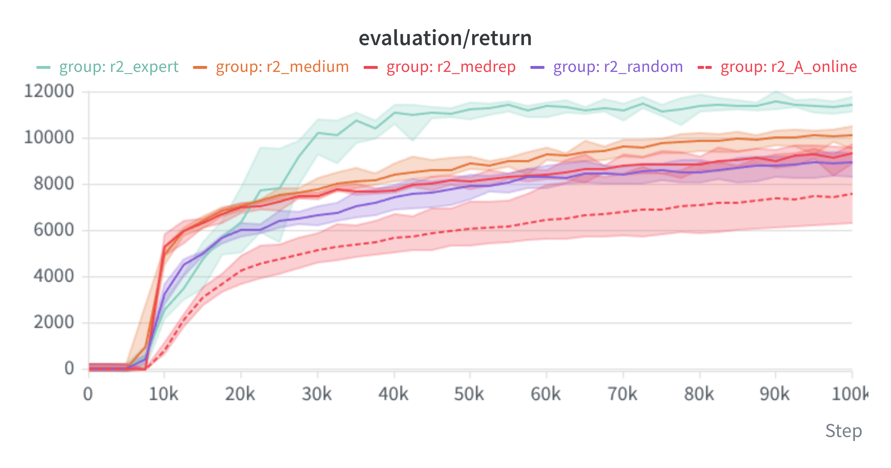

# R2 数据质量阶梯报告（100k 步）

> 5 seeds 配对实验（seed = 0–4），halfcheetah，**100k env steps**，`start_training=5000`，
> `eval_interval=2500`（41 个评估点），每点 20 episodes，`offline_ratio=0.5`，`utd_ratio=20`。
> 原始数据：`results/r2/r2_5seed_eval_return.csv`
> R1 对照：`results/r2/r2_vs_r1_prefix25k.txt`
> 运行时间：2026-09-15 13:53 → 22:45（25 runs，约 17.5 min/run）
> ⚠ 本报告的所有 run 都在修复 RNG 播种缺陷**之后**跑的（见 `REPRODUCIBILITY.md`），
> 同 seed 可逐位复现。

## 实验设计

固定 `utd_ratio=20`、`offline_ratio=0.5`、`configs/rlpd_config.py`，
**只动一个变量：离线数据集的质量档位**。

| 代号 | env（离线数据） | 数据水平（归一化分） | transitions |
|---|---|---|---|
| A online | —（`offline_ratio=0`） | — | 0 |
| random | `halfcheetah-random-v2` | -0.1 | 1,000,000 |
| medium-replay | `halfcheetah-medium-replay-v2` | 27.2 | **202,000** |
| medium | `halfcheetah-medium-v2` | 40.7 | 1,000,000 |
| expert | `halfcheetah-expert-v2` | 88.1 | 1,000,000 |

`medium-replay` 是关键对照：它与 `medium` 都来自同一个中等水平策略，但
`medium-replay` 是训练过程中的**整个 replay buffer**（水平中等、**多样性高**），
而 `medium` 是挑出来的完整 episode（水平中等、多样性低）。
这一对用来把"数据水平"与"数据多样性"拆开。

## 结果



| env steps | A online | random | medium-replay | medium | expert |
|---|---|---|---|---|---|
| 0 | 32.9 | 32.9 | 32.9 | 32.9 | 32.9 |
| 5 000 | 33.8 | 27.0 | 35.8 | 30.8 | 24.0 |
| 10 000 | 830.1 | 3 241.4 | **5 293.8** | 4 962.1 | **2 544.6** |
| 15 000 | 3 106.7 | 5 020.9 | 6 335.5 | **6 423.8** | 4 782.5 |
| 20 000 | 4 263.5 | 6 050.4 | 7 016.3 | **7 057.1** | 6 385.9 |
| 22 500 | 4 573.3 | 6 053.1 | 7 073.5 | 7 305.0 | **7 755.5** ← 反超 |
| 25 000 | 4 752.4 | 6 420.3 | 7 271.8 | 7 562.9 | **7 838.2** |
| 50 000 | 6 089.1 | 7 914.4 | 8 137.8 | 8 902.9 | **11 248.7** |
| **100 000** | **7 610.6** | **8 946.1** | **9 358.2** | **10 117.9** | **11 446.9** |
| 100k 末点极差 | **3 412.7** | 1 028.9 | 713.4 | 950.5 | **669.3** |
| **AUC**（0–100k） | 5 352.9 | 6 918.1 | 7 402.3 | 7 948.9 | **9 170.3** |

## 结论

### 1. 数据质量阶梯在 100k 下严格单调（末点与 AUC 一致）

```
末点:  expert 11446.9  >  medium 10117.9  >  medrep 9358.2  >  random 8946.1  >  online 7610.6
AUC :  expert  9170.3  >  medium  7948.9  >  medrep 7402.3  >  random 6918.1  >  online 5352.9
```

相邻档位的相对差距：expert 比 medium 高 **13.1%**，medium 比 medrep 高 **8.1%**，
medrep 比 random 高 **4.6%**，random 比纯在线高 **17.5%**。
AUC 上的差距更大（expert 比 online 高 **71%**），说明质量优势不只是末点，
**整段训练过程都更好**。

### 2. 即使是最差的离线数据（random）也显著优于纯在线

`random` 的离线数据本身回报约 -289（等于随机策略水平），但把它以 0.5 的比例混进训练，
100k 末点仍达 8946，比纯在线（7611）高 **17.5%**，AUC 高 **29%**。

这支持"离线数据的价值主要来自**状态空间覆盖**而非动作质量"这一解释 ——
即使是随机数据，也提供了大量真实的状态转移供 critic 学习。
（但要谨慎：本实验只有 halfcheetah 一个环境，见"局限"。）

### 3. ⚠️ R1 的结论 3 被推翻：medium 并没有"末点与 expert 持平"

R1 报告称"25k 时 medium(7406) 略高于 expert(7158)，统计上基本持平"。R2 在同样 25k 处的结论相反：

| 25k 处 | R1（修复前） | R2（修复后） |
|---|---|---|
| medium | 7 405.7 | 7 562.9 |
| expert | 7 157.5 | **7 838.2** |
| 谁更高 | medium（+3.5%） | **expert（+3.6%）** |

差异方向在修复后反转。结合单次同配置差异可达 10% 这一事实，
R1 那条"持平/略高"的结论确实落在噪声量级内 —— 与勘误判断一致。
**到 100k，expert 已明显领先（+13.1%）。**

### 4. ✅ 但 R1 的一个观察是真的：expert 数据在早期确实最差

这是本轮最有意思的发现，且**不是**噪声：

| 10k 处 | 值 |
|---|---|
| medium-replay | 5 293.8 |
| medium | 4 962.1 |
| random | 3 241.4 |
| **expert** | **2 544.6** ← 最差 |
| A online | 830.1 |

expert 数据在 10k 时比 medium 差 **约 2 倍**，甚至比 random 还差。
**交叉点落在 20k–22.5k 之间**（20k: medium 7057 > expert 6386；22.5k: expert 7756 > medium 7305）。

这是一个真实且值得解释的现象：**最好的数据在早期反而拖累了学习**。
可能的机制（待验证）：
- expert 的动作分布更"锐利"，与训练初期那个接近随机的策略距离更远 →
  早期 critic 在这些样本上的 TD 目标偏差更大；
- 也可能是 expert 数据的状态分布更集中于高回报区域，
  早期策略访问不到那些状态，导致离线样本的利用率低。

**注意：R1 观察到"expert 前期差"时我怀疑是伪影，现在证明这一半是对的、
另一半（末点被压制）是错的。** 所以 R1 并非全错，只是噪声掩盖了真实的时间演化。

### 5. 数据"水平"比"多样性"重要

`medium-replay` vs `medium` 这一对（同一策略、只差多样性）：
- **10k**：medrep 5 293.8 > medium 4 962.1 —— 多样性在**极早期**有一点优势；
- **12.5k 起**被反超；
- **100k**：medrep 9 358.2 < medium 10 117.9（低 **7.5%**）。

结论：**数据的"水平"是主导因素，"多样性"只在最早期有微弱帮助。**

⚠️ 但这个对比里混着一个第三变量：`medium-replay` 只有 **20.2 万**条 transition，
而 `medium` 有 **100 万**条（差 5 倍）。所以"medrep 更差"也可能来自**数据量**而非纯度。
要干净地拆开"多样性 vs 水平"，需要控制数据量（例如从 medium 里随机抽 20.2 万条）。

### 6. 离线数据不只提高均值，还大幅降低种子间方差

100k 末点的 5-seed 极差：

| 组 | 极差 |
|---|---|
| A online | **3 412.7** |
| random | 1 028.9 |
| medium | 950.5 |
| medium-replay | 713.4 |
| expert | **669.3** |

纯在线训练的种子间波动是离线数据组的 **3.3–5.1 倍**。
离线数据起到"稳定器"作用 —— 这本身就是一个有实用价值的观察，
也解释了为什么 RLPD 这类方法在真实机器人上更受欢迎（真实场景往往只有一个 seed 的机会）。

## 与 R1 的关系小结

| R1 结论 | R2（100k，修复后）判定 |
|---|---|
| 1. 离线数据的价值（B vs A，+61%） | ✅ 成立且更强（AUC +71%） |
| 2. 高 UTD 的价值（B vs C，-63%） | ⏸ 本轮未测（R1 的 utd=1 已证明无延伸价值） |
| 3. medium 前期更好、末点与 expert 持平 | ⚠️ **一半对一半错**：早期更好 ✅，末点持平 ❌ |
| 4. 交互效应（UTD 影响 > 离线数据） | ⏸ 本轮未测 |

## 局限（下结论前必须声明）

1. **只有 halfcheetah 一个环境**。所有结论都可能是任务特异的。
   要泛化至少需要 hopper / walker2d / ant 各跑一遍（成本：3 倍）。
2. **medium-replay 的数据量混淆**（20.2 万 vs 100 万），见结论 5。
3. **R1 与 R2 的 expert 组有 +5~9% 的系统性偏移**（R2 一致偏高）：
   10k 处 +342、15k 处 +381、25k 处 +681。修复播种后本应完全复现，
   但 R1 是修复前跑的，所以这个偏移无法归因 —— 可能是播种修复的真实影响，
   也可能是 R1 那 5 个 seed 恰好偏低。**未查明，标注为待办。**
4. **未做离线数据的分布分析**（π(a|s)、Q 值尺度）。结论 4 里"expert 早期差"的机制
   需要这类分析才能验证，而边际动作分布是无信息的（四档数据的 p(a) 几乎相同，
   见 `STUDY/scripts/dataset_stats.py` 的输出）。
5. **未做统计检验**。报告的是 5 seed 的均值与极差；由于 n=5，
   建议用配对 bootstrap 而非 t 检验。
6. 每个评估点只有 20 episodes × 5 seeds = 100 个 episode，
   均值标准误约 54（数据集的单 episode 回报标准差约 442–540）。

## 下一步候选

| 优先级 | 实验 | 目的 | 成本 |
|---|---|---|---|
| 高 | 控制数据量的 medium vs medrep（各抽 20.2 万条） | 拆开"多样性 vs 水平" | 10 runs ≈ 3 h |
| 高 | 加 `medium-expert-v2` | 补第 6 档，看混合数据的表现 | 5 runs ≈ 1.5 h |
| 中 | 换 hopper / walker2d 复现阶梯 | 验证结论是否任务特异 | 25 runs ≈ 7.5 h |
| 中 | **离线数据分布分析**（π(a|s) 距离、Q 值尺度演化） | 解释结论 4 的"expert 早期差" | 零训练成本 |
| 低 | 查清 R1↔R2 expert 组的 +5~9% 偏移 | 局限 3 | 需重跑 R1 配置 |
